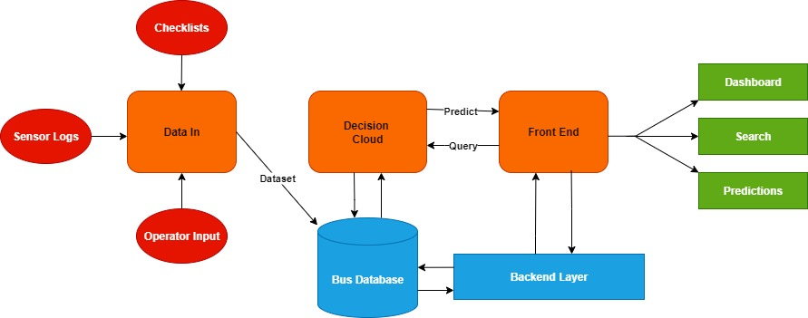

<h1>
  
  GreaseMonkey
</h1>
---

## System Architecture

---

## Features
- FastAPI backend  
- MySQL database  
- JWT authentication  
- Role-based access (Maintenance / Operator)  
- Frontend login interface  
- ML integration  

---

## Tech Stack
- FastAPI  
- MySQL  
- SQLAlchemy  
- JWT  
- HTML, CSS, JavaScript  

---

## Project Status
- Authentication and role-based routing completed  
- Operator input log page connected to authenticated login  
- Operator log history implemented  
- Admin/Maintenance dashboard connected to authenticated login  
